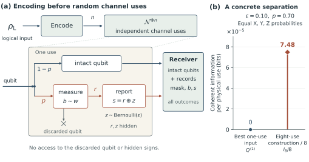

# Measurement Geometry and Coherent-Information Superadditivity

A qubit either arrives intact or is destructively measured along a randomly chosen, known axis. In the measured branch, the receiver gets the axis label and an imperfect outcome record, but not the measured qubit or the hidden true sign.

This project establishes a geometric sufficient condition for a collective-coding advantage: for **every finite measurement ensemble spanning all three Bloch directions**, and every **common symmetric reporting error** $`0\lt \epsilon\lt 1/2`$, there is a nonempty measurement-probability interval with

```math
Q^{(1)}(\mathcal N)=0\lt Q(\mathcal N).
```

Here $`Q^{(1)}`$ is coherent information optimized over every single-qubit input state. $`Q`$ is unassisted asymptotic quantum capacity. The result is a sufficient region, not an exact capacity formula or a practical finite-block decoding guarantee. The scalar inequality is partly computer assisted; all required certificates and separate verification implementations are included directly.

**[Read the project overview](reader/README.md)** · [Selected Preskill background and crosswalk](reader/background.md) · [Channel and eight-use illustration](reader/channel.md)

**Expert bypass:** [exact theorem](docs/MODEL_AND_CLAIMS.md#m04) · [complete proof](docs/COMPLETE_PROOF.md) · [figures and downloads](reader/figures.md) · [verification and evidence](reader/verification.md).

The learning route connects the result to selected passages from **John Preskill, Quantum Shannon Theory, arXiv:1604.07450v5**, then supplies this project's channel, coding and geometric explanations. It does not require the whole chapter or another tutorial. [Start at the focused reading map](reader/background.md), or bypass it and follow [the proof guide](reader/proof-guide.md).

These pages use ordinary GitHub Markdown and need no installation or ZIP download. The optional HTML site has its own navigation, local search and color controls; those controls are not executed by GitHub's file renderer. Both views are generated from `website/pages/`, with shared tutorial metadata in `website/learning_bridge.json`. [Build and maintenance instructions](WEBSITE.md)

## One finite illustration



For equal Pauli-axis weights, $`p=0.70`$ and $`\epsilon=0.10`$, the globally optimized one-use coherent information is zero. The included balanced eight-use construction has $`I_8/8\gt 7.47\times10^{-5}`$ bits per physical use. Every mask and record contributes, including the all-measured loss. An outer coding theorem provides the asymptotic rate interpretation; one inner block alone is not a near-perfect decoder. [Model and claims](docs/MODEL_AND_CLAIMS.md#m05) · [Complete witness argument](docs/COMPLETE_PROOF.md#p13)

## The geometric guarantee

With $`a=(1-2\epsilon)^2`$, $`c=1-a`$, define

```math
T=\sum_b w_b\mathbf n_b\mathbf n_b^{\mathsf T},\qquad \lambda=\lambda_{\min}(T),\qquad L=\min_{\|\mathbf u\|=1}\sum_b\frac{w_b c}{\sqrt{1-a(\mathbf n_b\cdot\mathbf u)^2}}.
```

For $`\lambda\gt 0`$, the theorem gives

```math
\frac{1}{1+L+(3ca/35)\lambda}\leq p\lt \frac{1}{1+L} \quad\Longrightarrow\quad Q^{(1)}=0\lt Q.
```

The coding direction and finite block length may depend on the known channel parameters, never on future realized measurement choices. The gap can shrink to zero near a coplanar ensemble or a reporting-noise endpoint. Coplanarity excludes this strict long-balanced-repetition comparison, not every possible collective code. [Precise theorem and quantifiers](docs/MODEL_AND_CLAIMS.md#m04) · [Complete proof](docs/COMPLETE_PROOF.md)

## Three approved figures

[Figure 1: channel and example](figures/approved/figure_01_channel_and_witness.pdf) · [Figure 2: guaranteed region](figures/approved/figure_02_guaranteed_region.pdf) · [Figure 3: approach to a plane](figures/approved/figure_03_coplanar_limit.pdf)

[All three with captions](figures/approved/three_figure_review.pdf) · [Scientific captions](figures/CAPTIONS.md) · [Panel specifications](figures/FIGURE_SPECIFICATIONS.md)

The PDF/SVG/PNG downloads and separate vector panels are available with [their identity record](provenance/APPROVED_FIGURE_HASHES.json). Figure 2 shows a conservative sufficient band, not an exact capacity phase diagram. The Figure 1 witness uses a sharper one-use bound and is not falsely placed inside that band. Figure 3's dashed line is an analytical asymptote, not a fitted slope.

## Read and reproduce

Read [the short scientific story](docs/FROZEN_ARGUMENT.md), [model and claim scope](docs/MODEL_AND_CLAIMS.md), [complete proof](docs/COMPLETE_PROOF.md), and [references with their roles](docs/REFERENCES.md). The channel is an established incomplete-erasure form; the construction uses known coherent-information coding principles. The asserted new content and priority limits are distinguished in those documents and the source record, not promoted to an absolute-first claim.

```bash
python -m venv .venv
source .venv/bin/activate
pip install -r requirements.txt
python verify.py
python -m pytest -q -p no:cacheprovider tests
python reproduce.py --output build/figures-check
python reproduce.py --output build/full-check --full
```

Use new output directories. The default reproduction rebuilds the plotting inputs, redraws every approved figure and checks their exact bytes in the recorded environment. `--full` additionally runs **all three full compact-certificate verifiers**, endpoint constants, independent retained-witness calculations, both declared controls, and direct small physical checks. Add `--rebuild-certificate` to regenerate the rational covering as well.

`verify.py` alone is an integrity/provenance check, **not** an entropy-inequality verification. See [REPRODUCTION.md](docs/REPRODUCTION.md) for exact command scopes, software versions, outputs, and byte-reproduction limitations.

## Project status and contents

**The repository is complete for its stated scientific result:** the channel model, theorem, full proof, computational certificate, independent verification implementations, finite witness and three figures are included. The [current status](STATUS.md) explains the scope and links the recorded checks. This is an author-verified research account; it has not undergone external peer review, and a manuscript is not included.

`docs/` contains the canonical scientific account; `certificates/` holds the rational proof input; `verification/` contains the independent arithmetic implementations; `data/figures/` contains plotting inputs; and `figures/` contains the figures, captions and renderer. The [evidence guide](reader/verification.md) explains how to inspect and reproduce the computational results.

## Reuse, citation and contact

Original code is licensed under **MIT**. Original prose, figures and data are licensed under **CC BY 4.0**, where the relevant rights exist. [LICENSE.md](LICENSE.md) defines the scope; [third-party notices](THIRD_PARTY_NOTICES.md) retain the separate terms of external components. Cite the repository using [CITATION.cff](CITATION.cff) and identify the exact commit used.

Contact: **Ruge Lin**, [gogoko699@gmail.com](mailto:gogoko699@gmail.com).
