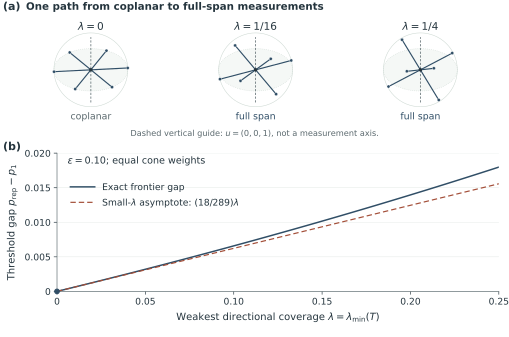

# Three figures, three questions

[Overview](README.md) · [Background](background.md) · [Channel](channel.md) · [Proof route](proof-guide.md) · [Figures](figures.md) · [Exact theorem](../docs/MODEL_AND_CLAIMS.md) · [Complete proof](../docs/COMPLETE_PROOF.md) · [Materials](materials.md)

All reading routes

- [The project](README.md)
- [Selected background](background.md)
- [The channel](channel.md)
- [The proof route](proof-guide.md)
- [Figure atlas](figures.md)
- [Scope and limits](limits.md)
- [Exact model and theorem](../docs/MODEL_AND_CLAIMS.md)
- [Complete proof](../docs/COMPLETE_PROOF.md)
- [Verification guide](verification.md)
- [Exact reproduction commands](../docs/REPRODUCTION.md)
- [References and their roles](../docs/REFERENCES.md)
- [Source materials](materials.md)
- [Notation crosswalk](../docs/NOTATION_CROSSWALK.md)
- [Source and proof ledger](../docs/SOURCE_TO_CANONICAL.md)
- [Visual design](visual-design.md)
- [Project status](status.md)

The figures answer questions introduced along the reading route. [Figure 1 explains the channel and finite witness](channel.md#eight-use-witness); [Figure 2 illustrates the geometric guarantee](proof-guide.md#geometric-guarantee); [Figure 3 follows the controlled approach to a plane](limits.md#cone-domain). This atlas consolidates their unchanged canonical captions, proof anchors, inputs and downloads.

The figures use the accepted Gachet-inspired palette. This palette applies only to the figures, not to the surrounding repository pages. Open the approved originals beneath each figure to compare. **The protected original exports remain unchanged.** The accepted display palette changes no data, geometry, labels or caption. The original PDF/SVG/PNG downloads retain their approved bytes.

[Approved figures and full captions](../figures/CAPTIONS.md) · [Scientific panel specifications](../figures/FIGURE_SPECIFICATIONS.md)

## Figure 1. The channel and a concrete separation

Accepted figure palette: [Accepted-palette SVG](assets/figure_01_channel_and_witness.svg). Protected originals: [Approved PDF](../figures/approved/figure_01_channel_and_witness.pdf) · [Approved SVG](../figures/approved/figure_01_channel_and_witness.svg) · [Approved PNG](../figures/approved/figure_01_channel_and_witness.png).

(a) An unknown logical input is encoded before independent channel uses. A qubit arrives intact with probability $`1-p`$; otherwise it is projectively measured along an axis $`b`$ drawn from $`w`$ and becomes inaccessible. The receiver gets the correct mask and axis label and the reported sign $`s=r\oplus z`$, where $`z`$ is an independent acquisition/report error with probability $`\epsilon`$. The true sign $`r`$, error variable $`z`$, and measured qubit are unavailable. Every outcome is included. (b) For equal Pauli-axis weights, $`\epsilon=0.10`$ and $`p=0.70`$, the globally optimized one-use coherent information is exactly zero: $`p`$ exceeds its threshold $`59/86`$. The balanced repetition input formed from the two eigenstates of $`(X+Y+Z)/\sqrt3`$ has $`I_8/8\gt 7.47\times10^{-5}`$ bits per physical use. This is one certified constructive value, not the optimal eight-use value or exact capacity. Positive block coherent information has an asymptotic rate interpretation through outer coding, not a demonstrated eight-qubit decoding fidelity. Numerical enclosures are smaller than the markers and are not statistical error bars.

**Proof:** [P01](../docs/COMPLETE_PROOF.md#p01) · [P13](../docs/COMPLETE_PROOF.md#p13). **Unchanged caption source:** [CAPTIONS.md](../figures/CAPTIONS.md).

**Numerical inputs:** [figure1_comparison.csv](../data/figures/figure1_comparison.csv) · [figure1_all_masks_not_for_display.csv](../data/figures/figure1_all_masks_not_for_display.csv) · [figure1_original_witness140.json](../data/figures/figure1_original_witness140.json).

## Figure 2. The geometric guarantee across reporting noise

Accepted figure palette: [Accepted-palette SVG](assets/figure_02_guaranteed_region.svg). Protected originals: [Approved PDF](../figures/approved/figure_02_guaranteed_region.pdf) · [Approved SVG](../figures/approved/figure_02_guaranteed_region.svg) · [Approved PNG](../figures/approved/figure_02_guaranteed_region.png).

The theorem gives a nonempty separation interval for every finite full-span measurement ensemble and common $`0\lt \epsilon\lt 1/2`$. The plotted slice has equal Pauli-axis weights, $`T=I/3`$ and $`\lambda=1/3`$. With $`a=(1-2\epsilon)^2`$, $`c=1-a`$, $`L=c/\sqrt{1-a/3}`$ and $`d_\epsilon=3ca/35`$, the solid curve is the sufficient one-use-zero bound $`p_{\mathrm{cert}}=[1+L+d_\epsilon/3]^{-1}`$, and the dashed curve is the repetition construction's strict frontier $`p_{\mathrm{rep}}=(1+L)^{-1}`$. Only $`p_{\mathrm{cert}}\leq p\lt p_{\mathrm{rep}}`$ at interior errors is shaded. The upper equality is not claimed; neither curve is labeled an exact capacity boundary, and unshaded regions remain unclassified. Open endpoints mark the perfect and fully random record limits, where there is no separation. The inset shows the interval width in $`p`$, not a communication rate, without thickening the strip. Figure 1 uses the sharper one-use threshold at $`\epsilon=0.1`$; its $`p=0.7`$ witness is below this conservative strip. The curves evaluate the proved analytical bound, not a simulation sweep.

**Proof:** [P08](../docs/COMPLETE_PROOF.md#p08) · [P10](../docs/COMPLETE_PROOF.md#p10). **Unchanged caption source:** [CAPTIONS.md](../figures/CAPTIONS.md).

**Numerical inputs:** [figure2_pauli_guaranteed_region.csv](../data/figures/figure2_pauli_guaranteed_region.csv) · [cross_figure_witness_bound_check.json](../data/figures/cross_figure_witness_bound_check.json).

## Figure 3. The approach to a plane

Accepted figure palette: [Accepted-palette SVG](assets/figure_03_coplanar_limit.svg). Protected originals: [Approved PDF](../figures/approved/figure_03_coplanar_limit.pdf) · [Approved SVG](../figures/approved/figure_03_coplanar_limit.svg) · [Approved PNG](../figures/approved/figure_03_coplanar_limit.png).

(a) Three equally probable axes are $`n_j=(\sqrt{1-\lambda}\cos(2\pi j/3),\sqrt{1-\lambda}\sin(2\pi j/3),\sqrt\lambda)`$, $`j=0,1,2`$, shown at $`\lambda=0,1/16,1/4`$ with one fixed orthographic camera and scale. Each solid line includes both signs of a single measurement axis. The dashed vertical is the axial coding-direction guide, not an additional measurement axis; the faint dotted ellipse indicates the reference plane. (b) At fixed $`\epsilon=0.10`$, the solid curve is the exact difference between the one-use positivity frontier $`p_1=(1-a\lambda)/(1-a\lambda+c)`$ and the repetition frontier $`p_{\mathrm{rep}}=\sqrt{1-a\lambda}/[\sqrt{1-a\lambda}+c]`$, within $`0\leq\lambda\leq1/4`$. The dashed line is the derived small-$`\lambda`$ asymptote $`(18/289)\lambda`$, not a fit. Their equality at $`\lambda=0`$ concerns these frontiers, not an all-code no-capacity claim. A nonzero gap need not supply a uniformly short block or useful rate. These cone ensembles differ from Figure 1's Pauli ensemble, so its finite-code value is not transferred here.

**Proof:** [P11](../docs/COMPLETE_PROOF.md#p11) · [P12](../docs/COMPLETE_PROOF.md#p12). **Unchanged caption source:** [CAPTIONS.md](../figures/CAPTIONS.md).

**Numerical inputs:** [figure3_cone_geometry.csv](../data/figures/figure3_cone_geometry.csv) · [figure3_cone_gap.csv](../data/figures/figure3_cone_gap.csv).

## Reading the bounds correctly

Figure 1's witness uses a sharper exact one-use threshold than the conservative universal strip in Figure 2. It is not silently placed inside that strip. Figure 3 fixes the reporting error and varies a different, cone-shaped measurement ensemble; the finite witness is not transferred to it. [Cross-figure consistency record](../data/figures/cross_figure_witness_bound_check.json)

The source captions describe deterministic numerical enclosures, not statistical confidence bars. Figure 3's dashed line is an analytical asymptote, not a fit. [Full figure specifications](../figures/FIGURE_SPECIFICATIONS.md)

---

[Previous: The proof route](proof-guide.md) · [Continue: Scope and limits](limits.md)

GitHub reading view generated from [the website source](../website/pages/figures.md). The equations, figure data and canonical captions retain their source meaning. Custom website navigation, local search and interactive color switching are not executed in this GitHub view.
