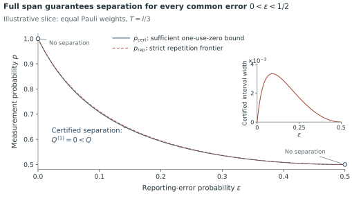
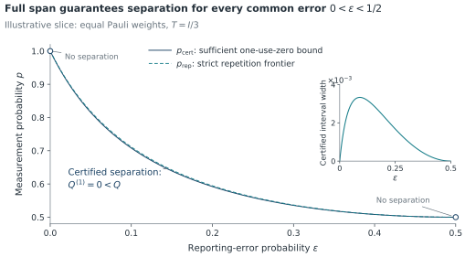

# Color from a painting, structure from the science

[Overview](README.md) · [Channel](channel.md) · [Proof route](proof-guide.md) · [Figures](figures.md) · [Exact theorem](../docs/MODEL_AND_CLAIMS.md) · [Complete proof](../docs/COMPLETE_PROOF.md) · [Materials](materials.md)

All reading routes

- [The project](README.md)
- [The channel](channel.md)
- [The proof route](proof-guide.md)
- [Figure atlas](figures.md)
- [Scope and limits](limits.md)
- [Exact model and theorem](../docs/MODEL_AND_CLAIMS.md)
- [Complete proof](../docs/COMPLETE_PROOF.md)
- [Verification guide](verification.md)
- [Exact reproduction commands](../docs/REPRODUCTION.md)
- [References and their roles](../docs/REFERENCES.md)
- [Source materials](materials.md)
- [Notation crosswalk](../docs/NOTATION_CROSSWALK.md)
- [Source and proof ledger](../docs/SOURCE_TO_CANONICAL.md)
- [Frozen scientific argument](../docs/FROZEN_ARGUMENT.md)
- [Visual design](visual-design.md)
- [Status and publication](status.md)

The reference is Vincent van Gogh's *Portrait of Dr. Gachet*, using the first version illustrated by the linked [Wikipedia article](https://en.wikipedia.org/wiki/Portrait_of_Dr._Gachet) and [Wikimedia file](https://commons.wikimedia.org/wiki/File:Portrait_of_Dr._Gachet.jpg). The palette below is a design interpretation of its dark blue clothing, pale blue-green background, yellow accents and warm red table. These are chosen display colors, not measured pigment values or an exact colorimetric extraction.

| Color role | Display value |
|---|---|
| ink | `#24343D` |
| indigo | `#304E66` |
| rust | `#A34E38` |
| sage | `#658B7A` |
| sage_ink | `#436856` |
| yellow | `#DDC465` |
| paper | `#F7F4EC` |
| white | `#FFFFFF` |
| muted | `#59676C` |
| mist | `#E8EFEA` |
| rule | `#CED9D3` |

## Roles, not decoration

Indigo carries primary structural information. A muted rust supplies the secondary plotted contrast. Sage is reserved for quiet backgrounds and navigation details. Yellow is an accent with dark text, never a pale numerical curve on white. The reading surface is warm off-white; the figure drawing surface stays white.

Mathematical roles still use labels, line patterns, markers and caption definitions. Color is not the sole indication of a bound or branch. A dashed frontier remains dashed, the shaded region keeps its actual width, and no interval becomes a statistical error bar.

## The approved figures remain the baseline

The site generates themed SVG derivatives by changing only a declared set of color literals in the approved SVGs. An exact normalization test checks that no other SVG content changed. The original PDF, PNG, SVG, captions, numerical inputs, panel geometry and scientific renderer are untouched. The themed variants are a color study until separately approved for paper exports.

**Gachet-inspired study**

**Approved original**

## Writing and mathematics

The new explanatory pages use My-tone's repository mode: concrete tasks, visible reasoning, exact commands, and local qualifications. Guidance was read from `GoGoKo699/My-tone` at commit `005873301782c06f21b1c6e73a5ce3b08c630cc4`. It is presentation guidance, not a scientific reviewer or an automated guarantee of semantic preservation. No private examples or unrelated personal writing are imported into this project.

The canonical technical documents are rendered directly. New reader-facing paragraphs link to their exact scientific sources. Equations, labels, proof fragments and evidence are not edited to achieve a stylistic preference. The site uses native MathML, local styles and local search, so the offline build does not fetch a third-party mathematics renderer or font.

---

[Continue: Status and publication](status.md)

GitHub reading view generated from [the website source](../website/pages/visual-design.md). The equations, figure data and canonical captions retain their source meaning. Custom website navigation, local search and interactive color switching are not executed in this GitHub view.
