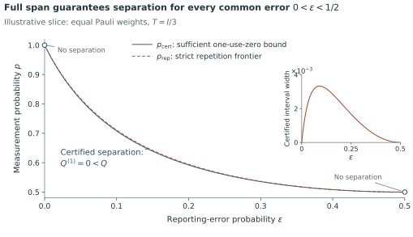
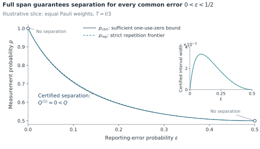

# Figure palette

[Overview](README.md) · [Background](background.md) · [Channel](channel.md) · [Proof route](proof-guide.md) · [Figures](figures.md) · [Exact theorem](../docs/MODEL_AND_CLAIMS.md) · [Complete proof](../docs/COMPLETE_PROOF.md) · [Materials](materials.md)

All reading routes

- [The project](README.md)
- [Selected background](background.md)
- [The channel](channel.md)
- [The proof route](proof-guide.md)
- [Figure atlas](figures.md)
- [Scope and controlled limits](limits.md)
- [Exact model and theorem](../docs/MODEL_AND_CLAIMS.md)
- [Complete proof](../docs/COMPLETE_PROOF.md)
- [Verification guide](verification.md)
- [Exact reproduction commands](../docs/REPRODUCTION.md)
- [References and their roles](../docs/REFERENCES.md)
- [Source materials](materials.md)
- [Notation crosswalk](../docs/NOTATION_CROSSWALK.md)
- [Proof and evidence index](../docs/SOURCE_TO_CANONICAL.md)
- [Visual design](visual-design.md)
- [Repository guide](status.md)

The Gachet-inspired palette applies to figures only. The repository uses GitHub's default Markdown, equation and image presentation. The optional HTML pages use a white reading surface, system typography and conventional link and navigation colors.

## Figure colors

The reference is Vincent van Gogh's *Portrait of Dr. Gachet*, using the first version illustrated by the linked [Wikipedia article](https://en.wikipedia.org/wiki/Portrait_of_Dr._Gachet). These are chosen display colors, not pigment measurements or an exact colorimetric extraction.

| Figure role | Color |
|---|---|
| Primary structure and bound | Indigo `#304E66` |
| Secondary plotted contrast | Terracotta `#A34E38` |
| Mathematical labels | Blue-black `#24343D` |
| Secondary labels | Muted gray `#59676C` |
| Supporting fills | Pale green `#DEE9DF` and `#E8EFEA` |
| Figure annotation surfaces | Warm off-white `#F7F4EC` |
| Drawing backgrounds | White `#FFFFFF` |

The palette entries describe figure drawing colors and their supporting surfaces. They are not a repository theme. Labels, line patterns, markers and caption definitions continue to distinguish the mathematical roles without relying on color alone.

## Compare figure palettes

The two palette versions share numerical inputs, geometry, text paths, markers, line patterns, opacity and captions. The comparison below shows their color choices. Reference PDF, PNG and SVG exports are available from the figure atlas, and their file identities are protected by the integrity checks.

**Figure palette**

**Alternative palette**

## Writing and mathematics

The technical documents are rendered directly. Explanatory paragraphs link to their exact scientific sources. The site uses native MathML, local styles and local search, so equations and navigation remain available offline.

---

[Previous: Proof and evidence index](../docs/SOURCE_TO_CANONICAL.md) · [Continue: Repository guide](status.md)

[Page source](../website/pages/visual-design.md)
